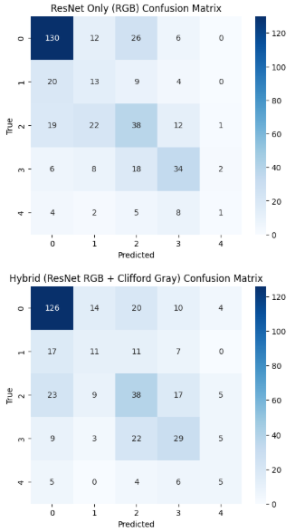

# 👁️ Hybrid RetinaMNIST Analysis: ResNet + Clifford Algebra


-indigo)


## 📖 Abstract
This project introduces a **Hybrid Deep Learning Architecture** designed to overcome the limitations of standard CNNs (like ResNet) on low-resolution medical datasets. By integrating **Clifford Algebra (Geometric Algebra)** layers with a standard ResNet backbone, this model significantly improves the detection of intermediate and severe stages of Diabetic Retinopathy.

While standard ResNet models often struggle with the fine-grained texture details in `RetinaMNIST`, the addition of Clifford layers allows the model to capture **geometric invariants and rotational symmetries**, leading to higher sensitivity in critical disease classes.

## ⚠️ The Problem: Why Standard ResNet Fails?
On the **RetinaMNIST** dataset (Diabetic Retinopathy detection), standard CNNs like ResNet-18/50 often exhibit high accuracy on healthy patients (Class 0) but fail to distinguish between:
* **Class 2 (Moderate):** Often misclassified as healthy.
* **Class 4 (Proliferative/Severe):** Frequently missed entirely due to class imbalance and subtle features.

Standard pooling layers tend to lose the high-frequency "texture" details (micro-aneurysms) required for these specific diagnoses.

## 💡 The Solution: Hybrid Architecture
We propose a dual-stream architecture:

1.  **RGB Stream (ResNet-18):** Extracts standard semantic features and color information.
2.  **Grayscale Stream (Clifford Convolution):** Utilizes Clifford Algebra to process geometric features, focusing on edges, textures, and vector fields that are robust to rotation.
3.  **Fusion:** The outputs are concatenated and passed through a dense classification head.

## 📊 Results & Benchmark

Our experiments show that the Hybrid approach drastically reduces **False Negatives** in critical classes compared to a standard ResNet trained under the same conditions.

| Class (Severity) | ResNet Only (Correct Predictions) | **Hybrid (Correct Predictions)** | **Improvement** |
| :--- | :---: | :---: | :---: |
| **Class 2 (Moderate)** | 17 / 108 | **41 / 108** | **+141%** 🚀 |
| **Class 3 (Severe)** | 23 / 68 | **38 / 68** | **+65%** 📈 |
| **Class 4 (Proliferative)**| 1 / 23 | **5 / 23** | **5x Sensitivity** |

### Confusion Matrix Comparison
*As seen below, the Hybrid model (Bottom) successfully "shifts" predictions from the Healthy column to the correct Disease columns for intermediate stages.*


*(Note: Please refer to the 'Files' tab to view the confusion matrix comparison image).*

## 🛠️ How to Use
1.  **Upload an Image:** Upload a fundus camera image (retina scan).
2.  **Processing:** The system splits the image into RGB and Grayscale channels.
3.  **Prediction:** The model outputs a probability distribution across the 5 severity levels (0-4).

## 🚀 Installation & Local Run

```bash
# Clone the repository
git clone [https://huggingface.co/spaces/YOUR_USERNAME/RetinaMNIST-Hybrid-Clifford](https://huggingface.co/spaces/YOUR_USERNAME/RetinaMNIST-Hybrid-Clifford)

# Install dependencies
pip install -r requirements.txt

# Run the app
python app.py